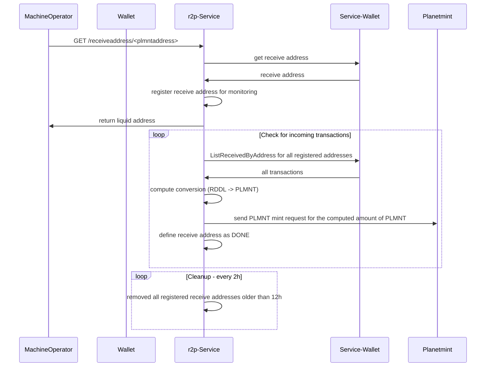

# rddl-2-plmnt-service
This service receives `GET requests` on `http(s)://localhost:8080/receiveaddress/<planetmint address>` and responds with a JSON object containing a `liquid-address` and the `planetmint-beneficiary` (the planetmint address of the input)
```json
{
    "liquid-address": "tlq1qq283mk7aav756sez29x4wgqdwnu69cae5uf3fmljamtm6xds5ltt80tdadcex9qst0jxljupme67jx5lqmydu74qksjjzkrrm", "planetmint-beneficiary": "plmnt1atfrnm80xyg86s85xp0av2ukap8n4ap7pevptm" 
}
```

Where the `beneficiary` is the receiving address on Planetmint, `liquid-address` is a receive address on Liquid being monitored for the next 12 hours. The incoming amount of RDDL tokens will be converted into PLMNT tokens that are minted and released to the `planetmint-beneficiary' address.

## Mechanics




## Execution
The service can be executed via the following go command without having it previously built:
```
go run cmd/rddl-2-plmnt-service/main.go
```

## Configuration
The service needs to be configured via the ```./app.toml``` file or environment variables. The defaults are
```
planetmint-address = "plmnt15xuq0yfxtd70l7jzr5hg722sxzcqqdcr8ptpl5"
planetmint-chain-id = "planetmint-testnet-1"
rpc-host = "planetmint-go-testnet-3.rddl.io:18884"
rpc-user = "user"
rpc-pass = "password"
planetmint-rpc-host = "127.0.0.1:9090"
service-port = 8080
service-bind = "localhost"
accepted-asset = "7add40beb27df701e02ee85089c5bc0021bc813823fedb5f1dcb5debda7f3da9"
wallet = "rddl2plmnt"
confirmations = 10
```

The defaults can be found at ```./config/config.go```.

**Important:** The `planetmint-address` needs to be the `MintAddress` configured on Planetmint in order to pass the `AnteHandler` check.